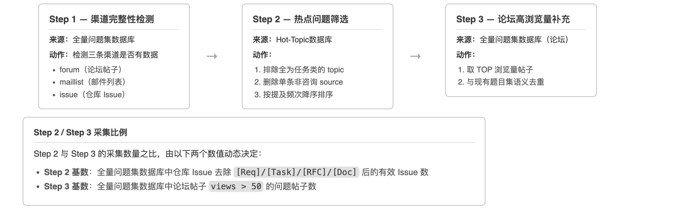

# 社区状态说明

### A 类社区

| 社区 | 问题集状态 | forum | maillist | issue（仓库） |
|---|---|---|---|---|
| openEuler | ✅ 准备完成，待填写官方链接 | ✅ 有数据 | ✅ 有数据 | ✅ 有数据 |
| MindSpore | ✅ 准备完成，待填写官方链接 | ✅ 有数据 | ✅ 有数据 | ✅ 有数据 |
| CANN | ✅ 准备完成，待填写官方链接 | ✅ 有数据 | ❌ 未接入 | ✅ 有数据 |
| UnifiedBus | ⏳ 待基础设施补充仓库渠道 | ❌ 无论坛 | ✅ 有数据 | ❌ 软件仓未接入 |

### B 类社区

| 社区 | 问题集状态 | forum | maillist | issue（仓库） |
|---|---|---|---|---|
| openGauss | ✅ 准备完成，待填写官方链接 | ✅ 有数据 | ✅ 有数据 | ✅ 有数据 |
| openUBMC | ✅ 准备完成，待填写官方链接 | ✅ 有数据 | ✅ 有数据 | ✅ 有数据 |
| openFuyao | ✅ 准备完成，待填写官方链接 | ❌ 无论坛 | ✅ 有数据 | ✅ 有数据 |
| BoostKit | ⏳ 待补充 | — | — | — |
| Mind 系列 | ⏳ 待补充 | — | — | — |


# 社区问题集收集逻辑说明

本文档说明 `/get-question` 技能的工作逻辑，供了解题目生成流程时参考。

---

## 功能定位

`get-question` 用于为某个社区生成 GEO 搜索评估题目集。它支持**增量追加**模式——每次运行只新增题目，不覆盖已有内容。输出文件为 `assessments/{community}/questions.json` 和 `questions.md`。

---

## 整体流程


---

## Step 1 - 渠道完整性检测（全量问题集数据库）

先连接 全量问题集数据库 检查社区数据是否覆盖全部三条渠道：

| 渠道 | 说明 |
|---|---|
| `forum` | 论坛帖子 |
| `maillist` | 邮件列表 |
| `issue` | 仓库 Issue |

**结果写入 `questions.md`**：在概览区输出「全量问题集数据库 渠道状态」表，供人工确认数据完整性：

| 渠道 | 状态 |
|------|------|
| 论坛帖子 | ✅ 有数据 |
| 仓库 Issue | ✅ 有数据 |
| 邮件列表 | ✅ 有数据 |

---

## Step 2 — 热点问题筛选（Hot-Topic数据库）

连接 Hot-Topic数据库，对 topic 执行两阶段处理：

### 阶段一：Topic 级过滤

- **排除**：某个 topic 下所有 source 的类型标签均为 `[Req]`/`[Task]`/`[RFC]`/`[Doc]` → 整个 topic 丢弃（纯任务类，无用户咨询价值）
- **保留**：只要存在至少一个 source 不属于上述四类标签，该 topic 就保留进入阶段二

### 阶段二：Source 级修剪与排序

对每个通过阶段一的 topic，在其 source 列表内部进一步处理：

1. **删除** 类型为 `[Req]`/`[Task]`/`[RFC]`/`[Doc]` 的单条 source
2. 保留剩余 source，并按**被提及次数从高到低排序**
3. 最终每个 topic 的 source 列表只包含 咨询类/Bug类/未分类 问题来源，排序反映该话题在不同渠道（论坛/Issue/邮件列表）中被提及的频次

**示例**：

```
原始 topic sources:
  [Bug]  论坛帖子 A   
  [Req]  需求 Issue B    ← 删除
  [Bug]  邮件 C       
  [Doc]  文档 D          ← 删除

处理后 sources:
  [Bug]  论坛帖子 A   
  [Bug]  邮件 C       
```

筛选结果送入 LLM，改写为完整的自然语言问题。

---

## Step 3 — 论坛高浏览量问题补充

从社区论坛中按浏览量抓取高热帖子，补充 Hot-Topic 数据库未能覆盖的用户问题。

### 抓取规则

- 数据来源：全量问题集数据库 `source_type='forum'`
- 筛选条件：`views > 50`
- 排序方式：按浏览量降序
- 全量问题集数据库不可用时，退回到 Discourse API 直接拉取社区论坛数据

### 来源比例说明

Step 2（Hot-Topic数据库聚合问题）与 Step 3（论坛高浏览量问题）的采集数量比例，由以下两个数值之比决定：

- **Step 2 基数**：全量问题集数据库中仓库 Issue 去除 `[Req]`/`[Task]`/`[RFC]`/`[Doc]` 标签后的剩余 Issue 数量
- **Step 3 基数**：全量问题集数据库中论坛帖子 `views > 50` 的问题帖子数量

例如，仓库有效 Issue 数为 120，论坛高浏览量帖子数为 40，则 Step 2 : Step 3 ≈ 3 : 1。


---