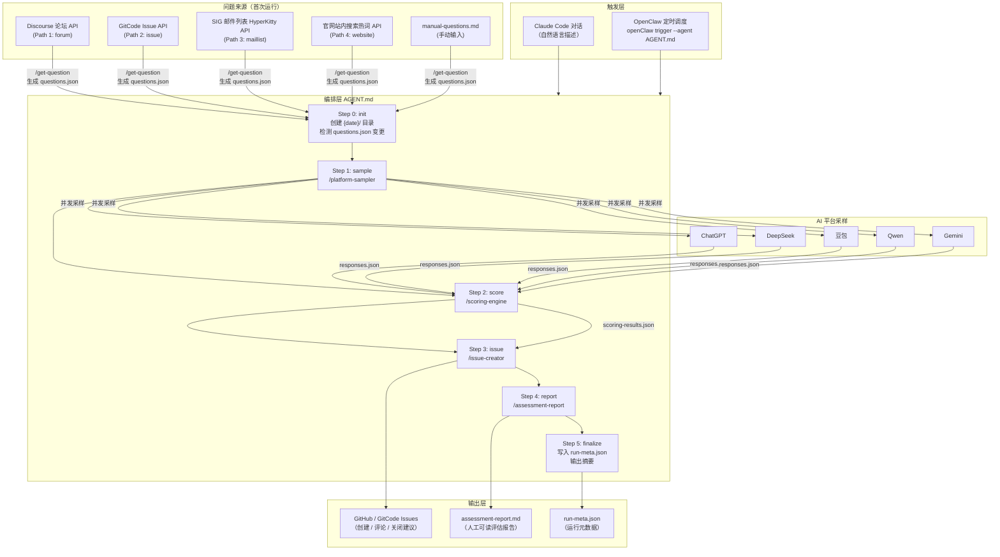
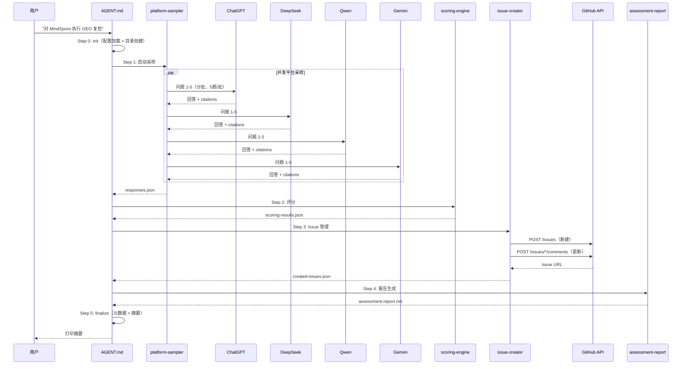
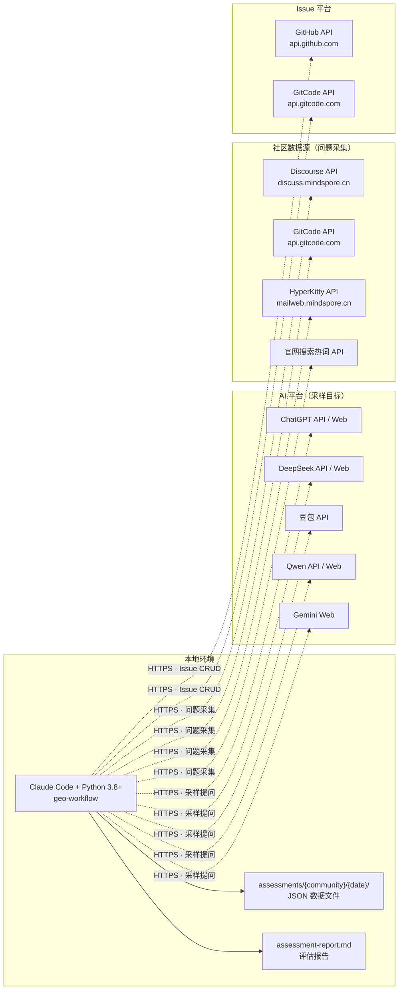

# GEO 搜索能力诊断系统技术设计文档

**状态:** 已发布
**作者:** ZhengZhenyu
**日期:** 2026-04-12
**版本:** 1.0

---

## 一、系统概述

本系统是一套 **GEO（Generative Engine Optimization）搜索能力诊断工具**，通过Agent触发：自动向主流 AI 平台（ChatGPT、DeepSeek、豆包、Qwen、Gemini）提问并收集回答，通过 URL 匹配评估官方内容引用情况，对开源社区的AI平台可搜索能力进行评估，输出评估结果，同时输出改进建议并自动在项目对应的 GitHub / GitCode 上创建和更新 Issue。

### 1.1 设计原则

- **Skill 链式流水线**: 5 个独立 Skill 串联，每步只读上游 JSON、只写自己的输出，无双向依赖
- **文件作为状态**: 所有中间状态以 JSON 文件持久化，无数据库，便于人工检查和修复
- **步骤可恢复**: 每个步骤均可独立重跑，支持从任意位置续跑
- **配置驱动**: 切换社区只需更新 `.env`，不修改任何代码
- **人工介入最小化**: 首次运行只有一个必要人工节点（填写 `official_urls`），后续复检全自动

### 1.2 支持平台与社区

**AI 平台：** ChatGPT · DeepSeek · 豆包 · Qwen · Gemini（按 `.env` 中有效 API Key 动态启用）

**目标社区：** 通过 `.env` 配置驱动，当前已支持：

> 新增社区只需在 `.env` 中配置 `GEO_COMMUNITY` 和 `GEO_COMMUNITY_DIR`，系统自动创建评估目录。问题源路径按需配置，未配置则跳过。

### 1.3 关键约束

| 约束 | 说明 |
|------|------|
| 运行环境 | Claude Code CLI + Python 3.8+，无需 Web 服务器或数据库 |
| 最小平台数 | 至少 2 个 AI 平台有效 API Key 才允许运行采样 |
| 采样规模 | MVP 阶段支持 30-50 个问题，上限 200 个 |

---

## 二、架构设计

| 视图 | 章节 | 关注点 |
|------|------|--------|
| **逻辑视图** | 2.1 | 系统功能、业务逻辑、数据流转 |
| **开发视图** | 2.2 | 代码组织、模块划分、依赖关系 |
| **进程视图** | 2.3 | 运行时行为、并发控制、执行时序 |
| **物理视图** | 2.4 | 部署拓扑、外部依赖、网络通信 |
| **场景视图** | 2.5 | 典型用例、用户交互流程 |

### 2.1 逻辑视图（Logical View）

逻辑视图描述系统的功能组成和业务逻辑分层：



**功能分层说明：**

| 层级 | 职责 | 核心组件 |
|------|------|---------|
| **触发层** | 接收用户请求，路由到执行流水线 | Claude Code 对话 / OpenClaw 定时任务 |
| **问题来源层** | 从社区真实数据中提取代表性搜索问题 | `get-question` Skill，4 条自动化路径 + 手动标注 |
| **编排层** | 6 步流水线控制，参数化执行 | `AGENT.md`，Step 0-5 |
| **AI 平台层** | 向各 AI 平台并发发送问题并收集回答 | `platform-sampler` Skill，Playwright / API 双模式 |
| **评分与行动层** | URL 匹配评分 → 建议匹配 → Issue 创建 | `scoring-engine` + `issue-creator` + `assessment-report` |

### 2.2 开发视图（Development View）

开发视图描述代码的物理组织和模块划分：

```
geo-workflow/
├── AGENT.md                           # 工作流编排入口（6 步流水线）
├── CLAUDE.md                          # Claude Code 开发规则
├── .env.example                       # API Key 配置模板
│
├── assessments/{community}/           # 评估数据（按社区 + 日期隔离）
│   ├── questions.json                 # 符号链接 → 当前问题集
│   ├── issue-map.json                 # 累积 Issue 映射（跨运行）
│   ├── summary/                       # 跨运行汇总数据
│   └── {YYYY-MM-DD}/                  # 单次运行数据
│
├── .claude/skills/                    # Skill 定义（Claude Code 执行单元）
│   ├── get-question/                  # 问题集生成
│   │   ├── SKILL.md                   # 8 步过程定义
│   │   ├── scripts/                   # Python 脚本（5 个）
│   │   ├── references/                # API 规范（3 个）
│   │   └── assets/                    # 模板和提示词
│   ├── platform-sampler/              # AI 平台采样
│   │   ├── SKILL.md                   # 5 步过程定义
│   │   ├── scripts/                   # Python 脚本（4 个）
│   │   ├── references/                # 速率限制规范
│   │   └── assets/                    # 输出模板
│   ├── scoring-engine/                # 评分与诊断
│   │   ├── SKILL.md                   # 6 步过程定义
│   │   ├── scripts/                   # Python 脚本（2 个）
│   │   ├── references/                # GEO 建议目录 + 匹配规则
│   │   └── assets/                    # 建议输出模板
│   ├── issue-creator/                 # Issue 创建与追踪
│   │   ├── SKILL.md                   # 7 步过程定义
│   │   ├── scripts/                   # Python 脚本（3 个）
│   │   ├── references/                # GitCode API 规范
│   │   └── assets/                    # Issue 模板
│   └── assessment-report/             # 评估报告生成
│       ├── SKILL.md                   # 6 步过程定义
│       ├── references/                # 指示符规则
│       └── assets/                    # 报告模板
│
├── docs/                              # 设计文档
│   ├── PRD.md
│   ├── architecture.md                # 本文档
│   ├── data-model.md
│   └── geo-theory.md
│
└── .claude/
    └── settings.json                  # Claude Code 项目级配置
```

**模块依赖关系：**

```
get-question ──► questions.json
                      │
                      ├──► platform-sampler ──► responses.json
                      │                              │
                      │                              ├──► scoring-engine ──► scoring-results.json
                      │                              │                              │
                      │                              │                              ├──► issue-creator ──► GitHub/GitCode Issues
                      │                              │                              │        │
                      │                              │                              │        └──► issue-map.json
                      │                              │                              │
                      │                              │                              └──► assessment-report ──► report.json + .md
                      │                              │
                      │                              └──► 直接引用（报告）
                      │
                      └──► 直接引用（报告各问题描述）
```

**关键设计模式：**

| 模式 | 应用场景 |
|------|---------|
| **管道-过滤器** | 5 个 Skill 串联为单向流水线，每步只依赖上游 JSON 输出 |
| **配置驱动** | `.env` 控制社区切换、API Key 启用/禁用，Skill 脚本不硬编码 |
| **文件作为契约** | 所有 Skill 间通过 JSON Schema 约定交接格式，方便独立测试和重跑 |
| **追加而非覆盖** | 问题集追加、Issue 映射累积、采样支持 append 模式，保证幂等性 |
| **两步采样** | Web UI（Playwright，有引用链接）与 API（OpenAI-compatible，快速）互补，优先 API 兜底 Web |

### 2.3 进程视图（Process View）

进程视图描述系统运行时的执行时序和并发行为：



**并发控制策略：**

| 场景 | 并发方式 | 限制 |
|------|---------|------|
| **多平台采样（同一问题批次）** | 顺序调用，平台间间隔 1s | 避免触发频率限制 |
| **多问题批次** | 顺序分批（5 题/批） | 防止单平台上下文污染 |
| **单平台失败处理** | `try/except` 隔离，标记 `status=error` | 不影响其他平台采样 |
| **即时写入** | 每批次采样结果立即 flush 到 `responses.json` | 防止中断丢失数据 |
| **评分 / Issue / 报告** | 同步串行执行 | 单步骤 ≤ 30s |

**采样执行流程伪代码：**

```python
questions = load_questions(filtered_by_scope)
platforms = detect_enabled_platforms_from_dotenv()

for batch in chunk(questions, 5):
    for question in batch:
        for platform in platforms:
            try:
                response = sample_platform(platform, question)
                result = {"status": "success", "citations": response.citations}
            except Exception as e:
                result = {"status": "error", "error": str(e)}
            
            append_to_responses_json(question.id, platform, result)
            sleep(1)  # 平台间冷却间隔
```

### 2.4 物理视图（Physical View）

物理视图描述系统的部署拓扑和外部依赖：



**部署说明：**

| 组件 | 位置 | 说明 |
|------|------|------|
| **主程序** | 本地单机 | 无需数据库或 Web 服务，Claude Code 对话驱动 |
| **AI 平台 API** | 各平台云端 | 需 API Key（Web 模式需 Session Token） |
| **社区数据源** | 各社区服务器 | 按需配置，未配置则跳过对应路径 |
| **Issue 平台** | GitHub / GitCode | 需 Personal Access Token |
| **数据存储** | 本地 JSON 文件 | `assessments/{community}/{date}/`，按日期隔离 |

**网络要求：**

| 方向 | 目标 | 协议 | 用途 |
|------|------|------|------|
| 本地 → 远程 | AI 平台 API | HTTPS | 采样提问与引用采集 |
| 本地 → 远程 | Discourse / GitCode / HyperKitty API | HTTPS | 问题集生成（数据采集） |
| 本地 → 远程 | GitHub / GitCode API | HTTPS | Issue 创建和评论 |

### 2.5 场景视图（Scenarios / Use Cases）

场景视图通过典型用例串联上述 4 个视图：

#### 场景 1：首次运行 — 建立 MindSpore GEO 基线

```
用户: "对 MindSpore 生成问题集并完成首次 GEO 评估"
    │
    ├─► Step 0: init — 创建 assessments/MindSpore/2026-04-14/ 目录
    │
    ├─► /get-question — 4 条路径并发采集
    │       Path 1: Discourse 论坛 → 30 个热帖问题
    │       Path 2: GitCode Issue → 15 个高频 Issue 改写
    │       Path 3: SIG 邮件列表 → 8 个讨论问题
    │       Path 4: 官网搜索热词 → 12 个搜索问题
    │       → 语义去重后合并 50 题 → questions.json
    │
    ├─► 【人工介入】标注每个问题的 official_urls
    │
    ├─► /platform-sampler — 4 平台并发采样
    │       50 题 × 4 平台 = 200 次调用
    │       → responses.json
    │
    ├─► /scoring-engine — URL 匹配 + 引用率计算
    │       satisfied=12, not_cited=30, no_official_content=8
    │       → scoring-results.json（含 GEO 建议）
    │
    ├─► /issue-creator — LLM 分组 → 创建 15 个 Issue
    │       → issue-map.json + created-issues.json
    │
    └─► /assessment-report — 生成基线报告
            → assessment-report.md（人工可读）
```

#### 场景 2：定期复检 — P0 问题重检

```
用户: "按照 AGENT.md 对 MindSpore 执行 GEO 复检，scope=p0"
    │
    ├─► Step 0: init — 检测 questions.json 无变更，创建 2026-04-21/ 目录
    │
    ├─► /platform-sampler — 仅采样 30 个 P0 问题
    │       30 题 × 4 平台 = 120 次调用
    │       → responses.json
    │
    ├─► /scoring-engine — 重新评分
    │       satisfied=15 (+3), not_cited=25 (-5)
    │       → scoring-results.json
    │
    ├─► /issue-creator — 比对 issue-map.json
    │       5 个 Issue 引用率改善 → 追加评论
    │       3 个 Issue satisfied → 追加关闭建议
    │       → 更新 issue-map.json
    │
    └─► /assessment-report — 趋势对比
            → assessment-report.md（标注 improved/regressed/stable）
```

#### 场景 3：仅重新评分（跳过采样）

```
用户: "steps=2,3,4,5 scope=p0"
    │
    ├─► Step 0: init — 复用上次运行的 questions.json 快照
    ├─► Step 1: 跳过（steps 参数不含 1）
    ├─► Step 2: /scoring-engine — 使用已有 responses.json 重新评分
    ├─► Step 3: /issue-creator
    ├─► Step 4: /assessment-report
    └─► Step 5: finalize
```

**两种核心运行模式对比：**

| 模式 | 场景 | 人工介入点 | 触发方式 |
|------|------|-----------|---------|
| **首次运行** | 建立基线，生成问题集和标注 | 需填写 `official_urls` | 手动逐步执行 |
| **定期复检** | 周期性重新评估，更新 Issue | 无需人工介入 | Claude Code 对话 / OpenClaw |

---

## 三、模块详解

### 3.1 编排层（AGENT.md）

AGENT.md 是唯一的流程控制入口，不含业务逻辑：

```
AGENT.md
├── Step 0 (init)      解析参数 + .env → 合并配置；检测 questions.json 变更；创建 {date}/ 目录
├── Step 1 (sample)    根据 scope 参数过滤问题 → 调用 /platform-sampler
├── Step 2 (score)     调用 /scoring-engine
├── Step 3 (issue)     调用 /issue-creator
├── Step 4 (report)    调用 /assessment-report
└── Step 5 (finalize)  写 run-meta.json；校验 issue activity 一致性；打印摘要 + 行动提示
```

**支持的调用参数：**

| 参数 | 说明 | 示例 |
|------|------|------|
| `steps` | 选择执行哪些步骤 | `steps=2,3,4,5`（跳过采样，直接重新评分） |
| `scope` | 问题范围（`all` / `p0` / 指定 ID） | `scope=p0`（只重检 P0 问题） |
| `accept_question_update` | 问题集有变更时才需要 | `accept_question_update=true` |
| `dry_run` | 不执行实际 API 写操作 | `dry_run=true` |

---

### 3.2 问题采集（get-question）

```
.claude/skills/get-question/
├── SKILL.md                        # 8 步过程定义
├── scripts/
│   ├── parse-manual-questions.py   # 解析 manual-questions.md → JSON
│   ├── fetch-forum-posts.py        # Discourse API → 热帖标题 → LLM 改写
│   ├── fetch-repo-issues.py        # GitCode Issue API → LLM 改写（需 GITCODE_TOKEN）
│   ├── fetch-sig-info.py           # SIG MagicAPI → HyperKitty → LLM 过滤
│   └── validate-questions.py       # 输出校验
├── references/
│   ├── forum-api-spec.md           # Discourse API 端点规范
│   ├── gitcode-api-spec.md         # GitCode API 端点规范
│   └── sig-api-spec.md             # SIG / HyperKitty API 规范
└── assets/
    ├── questions-template.md       # questions.md 输出模板
    └── prompt-templates.md         # LLM 改写提示词
```

**关键行为：**
- 每次执行**追加**新问题到已有 `questions.json` 末尾，不覆盖
- 语义去重：新问题与已有问题语义相似时自动跳过
- `official_urls` 和 `notes` 字段在追加操作中**保持不变**
- 输出：`questions.json`（机器可读）+ `questions.md`（人工可读）

---

### 3.3 AI 平台采样（platform-sampler）

```
.claude/skills/platform-sampler/
├── SKILL.md                        # 5 步过程定义
├── scripts/
│   ├── sample-platform.py          # 单问题单平台采样（LLM 后处理提取元数据）
│   ├── run-sampler.py              # 批量入口（5 问题/批，平台间 1s 间隔）
│   ├── validate-input.py           # 输入校验
│   └── validate-responses.py       # 输出校验（覆盖率报告）
├── references/
│   └── platform-rate-limits.md     # 各平台速率限制
└── assets/
    └── responses-template.md       # responses.json 输出模板
```

**采样策略：**
```
questions.json → 按 scope 过滤 → 分批（5 题/批）
  └── 对每个问题：
        └── 顺序调用各平台（同平台间隔 1s）
              └── 成功 → 提取 citations / mentions_community / recommendation_position
                  失败 → 标注 status=error，继续下一平台
              └── 即时 flush 写入 responses.json（防止中断丢失）
→ 最终合并（append 模式）去重（question_id + platform 为唯一键）
```

---

### 3.4 评分与诊断（scoring-engine）

```
.claude/skills/scoring-engine/
├── SKILL.md                        # 6 步过程定义
├── scripts/
│   ├── validate-inputs.py          # 校验 responses.json + questions.json
│   └── compile-report.py           # URL 匹配 → 聚合 → 建议匹配 → 写 scoring-results.json
├── references/
│   ├── geo-suggestions-catalog.md  # 72 条 GEO 建议目录（13 类别）
│   ├── suggestion-rules.md         # status → 建议映射规则
│   └── scoring-prompt-template.md  # 预留（当前评分无 LLM）
└── assets/
    └── suggestions-template.md     # 建议输出模板
```

**评分流程：**
```
对每个 (question_id, platform) 对：
    1. 归一化 responses.json 中的 citation URL（去 scheme/trailing-slash/query）
    2. 与 questions.json 中的 official_urls 逐一比对（精确字符串匹配）
    3. 命中任意一个 → cited=true

对每个 question_id 聚合：
    citation_rate = cited 平台数 / 总平台数

    if official_urls == []:     → no_official_content (P1)
    elif citation_rate >= 0.75: → satisfied (OK)
    else:                       → not_cited (P0)

→ 按 status + citation_rate 区间从 geo-suggestions-catalog 中匹配建议
→ 写入 scoring-results.json
→ 同步 official_urls 回 questions.md（新增「官方链接」列）
```

---

### 3.5 Issue 创建与追踪（issue-creator）

```
.claude/skills/issue-creator/
├── SKILL.md                        # 7 步过程定义
├── scripts/
│   ├── parse-suggestions.py        # 解析 scoring-results.json → 候选 Issue 列表
│   ├── create-issue.py             # GitHub / GitCode Issue 创建 API
│   └── comment-issue.py            # Issue 追加评论 API
├── references/
│   └── gitcode-api-spec.md         # GitCode Issue / Comment API 规范
└── assets/
    └── issue-template.md           # Issue 正文模板（现象、根因、action items）
```

**去重与状态机制：**
```
scoring-results.json（本次评分）
    ↓
LLM 语义分组（将相关问题聚合为一组）
    ↓
与 issue-map.json 比对（match key: question_ids 重叠度 ≥ 50%）
    ├── 无匹配 → 创建新 Issue → 写入 issue-map.json
    ├── 有匹配 + status 变化 → 追加评论（含引用率变化）
    └── 有匹配 + status = satisfied → 追加关闭建议评论
→ 写 created-issues.json（本次活动日志）
```

---

### 3.6 评估报告（assessment-report）

```
.claude/skills/assessment-report/
├── SKILL.md                        # 6 步过程定义
├── references/
│   └── indicator-rules.md          # 平台指示符（✅/❌/—）判断规则和列序
└── assets/
    └── report-template.md          # assessment-report.md 输出模板
```

**输入 → 输出：**
```
scoring-results.json   ╮
questions.json         ├─→ 按三类现象分组（no_official_content / not_cited / satisfied）
issue-map.json         ╯       → 每题：平台指示符 + 引用率 + 严重级别 + Issue URL + 迭代次数
                               → 与上次报告对比：标注 new / improved / regressed / stable
                     ↓
assessment-report.json（机器可读）
assessment-report.md（人工可读 Markdown）
```

---

## 四、全流程数据流追踪

以"对 MindSpore 社区执行一次完整复检"为例：

```
用户在 Claude Code 输入："按照 AGENT.md 对 MindSpore 执行一次 GEO 复检"
    │
    ▼
AGENT.md Step 0 (init)
    ├── 读取 .env → GEO_COMMUNITY=MindSpore, GEO_COMMUNITY_DIR=assessments/MindSpore/
    ├── 比对 questions.json 与上次运行快照 → 无变更，继续
    └── 创建 assessments/MindSpore/2026-04-14/ 目录
    │
    ▼
AGENT.md Step 1 (sample) → /platform-sampler
    ├── 加载 assessments/MindSpore/questions.json（42 个问题）
    ├── 检测 .env 中有效 Key: deepseek ✅, qwen ✅, gemini ✅, chatgpt ✅, doubao ❌
    ├── 分 9 批（每批 5 题）× 4 平台 = 168 次 API 调用
    └── 输出 assessments/MindSpore/2026-04-14/responses.json（168 条，3 条 error）
    │
    ▼
AGENT.md Step 2 (score) → /scoring-engine
    ├── 读取 responses.json + questions.json（含 official_urls）
    ├── 对 168 个 (question_id, platform) 对执行 URL 匹配
    ├── 聚合：42 题中 8 题 satisfied, 30 题 not_cited, 4 题 no_official_content
    └── 输出 assessments/MindSpore/2026-04-14/scoring-results.json
    │
    ▼
AGENT.md Step 3 (issue) → /issue-creator
    ├── 读取 scoring-results.json + assessments/MindSpore/issue-map.json（已有 18 组）
    ├── LLM 对 30 个 not_cited 问题语义分组 → 14 组
    ├── 与 issue-map.json 比对 → 12 组匹配已有 Issue（追加评论），2 组新建
    ├── 调用 GitHub API: POST /issues × 2, POST /issues/*/comments × 12
    └── 更新 issue-map.json，写 assessments/MindSpore/2026-04-14/created-issues.json
    │
    ▼
AGENT.md Step 4 (report) → /assessment-report
    ├── 读取 scoring-results.json + questions.json + issue-map.json
    ├── 与上次报告（2026-04-07/assessment-report.json）对比
    └── 输出 assessments/MindSpore/2026-04-14/assessment-report.json + .md
    │
    ▼
AGENT.md Step 5 (finalize)
    ├── 验证 issue activity（created-issues.json 统计与 run-meta 一致）
    ├── 写入 assessments/MindSpore/2026-04-14/run-meta.json
    └── 打印摘要：satisfied=8, not_cited=30, no_official_content=4, issues_created=2, issues_updated=12
```

---

## 五、数据持久化

### 5.1 目录结构

```
assessments/{community}/
│
├── questions.json          ← 符号链接（指向 question.json 或 questions-new.json）
├── questions-new.json      ← 新问题集（待人工标注 official_urls）
├── questions-new.md        ← 新问题集 Markdown 视图
├── issue-map.json          ← 累积 Issue 映射（跨运行不覆盖）
│
├── summary/                ← 【新增】汇总目录（跨运行历史数据汇总）
│   ├── response.json           汇总响应数据
│   ├── scoring-results.json    汇总评分结果
│   └── scoring-report.md       汇总评估报告
│
├── previous-question/      ← 【新增】历史问题目录（历史问题评分）
│   ├── scoring-results.json    历史问题评分结果
│   └── scoring-report.md       历史问题报告
│
└── {YYYY-MM-DD}/           ← 每次 AGENT.md 运行创建一个日期目录
    ├── questions.json          questions.json 快照（防止后续修改影响评分）
    ├── responses.json          platform-sampler 输出
    ├── scoring-results.json    scoring-engine 输出
    ├── created-issues.json     issue-creator 活动日志（本次）
    ├── assessment-report.json  assessment-report 输出（机器可读）
    ├── assessment-report.md    assessment-report 输出（人工可读）
    └── run-meta.json           AGENT.md 运行元数据
```

**注意**：
- `questions.json` 现在是符号链接，通过修改链接目标切换问题集版本
- `summary/` 目录汇总多次运行的历史数据，便于趋势分析
- `previous-question/` 目录存储历史问题评分，用于对比分析
- `responses.json` 在部分运行中命名为 `response.json`（单数形式），两者格式相同

### 5.2 跨运行持久状态

只有少数文件跨运行保持状态，其余均按日期隔离：

| 文件 | 跨运行作用 | 维护方式 |
|------|-----------|---------|
| `questions.json`（符号链接） | 问题集版本切换 | 符号链接指向当前版本 |
| `questions-new.json` | 问题集 + `official_urls` 标注 | 半自动（脚本追加，人工标注 official_urls） |
| `issue-map.json` | suggestion → GitHub Issue 去重映射 | 全自动（累积追加） |
| `summary/*` | 历史数据汇总 | 全自动（跨运行汇总） |
| `previous-question/*` | 历史问题评分 | 全自动（历史对比分析） |

**新增数据流**：

```
历史运行数据（{date}/*）
    ↓ 汇总
summary/scoring-results.json（跨运行汇总）
    ↓ 报告生成
summary/scoring-report.md（趋势分析）

历史问题评分
    ↓ 对比
current_question.json（当前问题集）
    ↓ 评分差异分析
previous-question/scoring-report.md
```

---

## 六、技术选型

### 6.1 核心依赖

| 技术 | 用途 | 说明 |
|------|------|------|
| Python 3.8+ | Skill 脚本语言 | 各 Skill 下的 `scripts/*.py` |
| Claude Code Skill | 流程编排和 LLM 调用 | AGENT.md + SKILL.md 机制 |
| JSON | 数据交换格式 | 所有中间状态持久化，无数据库 |
| Markdown | 报告和问题集输出 | 人工可读 |
| `.env` | 配置管理 | 社区切换、API Key 管理 |

### 6.2 Python 依赖（按模块）

**数据采集 & 问题生成（get-question）：**

| 库 | 用途 |
|----|------|
| `requests` | Discourse / GitCode / 官网 API 的 HTTP 同步调用 |
| `openai` | OpenAI API 客户端，LLM 改写问题标题 |
| `json`（标准库） | JSON 读取和问题集输出 |

**AI 平台采样（platform-sampler）：**

| 库 | 用途 |
|----|------|
| `playwright` | Chromium 浏览器自动化，Web UI 采样 |
| `requests` | OpenAI-compatible API 快速采样 |

**评分与报告（scoring-engine / assessment-report）：**

| 库 | 用途 |
|----|------|
| `json`（标准库） | JSON 读写和数据聚合 |
| `datetime`（标准库） | 时间戳和周期计算 |
| `re`（标准库） | URL 归一化正则匹配 |

**Issue 创建（issue-creator）：**

| 库 | 用途 |
|----|------|
| `requests` | GitHub / GitCode REST API 调用 |

### 6.3 采样方式对比

本系统支持两种 AI 平台采样方式：

| 方式 | 工具 | 适用平台 | 优点 | 缺点 |
|------|------|---------|------|------|
| **Web UI 采样** | Playwright + Chromium | ChatGPT, DeepSeek, Gemini, Qwen | 获取完整引用链接；与真实用户体验一致 | 较慢（每题 ~90s）；需维护 Session Token |
| **API 采样** | OpenAI-compatible API | DeepSeek, Qwen, Doubao | 快速（每题 2-5s）；无需登录 | 无引用链接；部分平台不支持 |

**Web UI 采样（Playwright）脚本：**

| 脚本 | 平台 | 登录方式 |
|------|------|---------|
| `ask-chatgpt.py` | ChatGPT | Session Token |
| `ask-gemini.py` | Gemini | 匿名访问 / Session Token（启用 Search Grounding） |
| `ask-qwen.py` | Qwen | localStorage Token / 自动登录 |
| `ask-deepseek.py` | DeepSeek | Cookie / 自动登录 |

**安装要求：**

```bash
pip3 install playwright
python3 -m playwright install chromium
```

### 6.4 外部服务依赖

| 服务 | 用途 | 必需 | 备选 |
|------|------|------|------|
| ChatGPT API / Web | AI 平台采样 | 按 Key 启用 | 无 Key 则跳过该平台 |
| DeepSeek API / Web | AI 平台采样 | 按 Key 启用 | 同上 |
| 豆包 API | AI 平台采样 | 按 Key 启用 | 同上 |
| Qwen API / Web | AI 平台采样 | 按 Key 启用 | 同上 |
| Gemini Web | AI 平台采样 | 按 Key 启用 | 同上 |
| Discourse API | 论坛热帖采集（Path 1） | 可选 | 无则跳过该路径 |
| GitCode API | Issue 采集（Path 2）+ Issue 创建 | 需 Token | GitHub API 作为 Issue 创建备选 |
| GitHub API | Issue 创建和评论 | 需 Token | GitCode API 作为备选 |
| LLM 服务 | 问题改写 + Issue 语义分组 | 需要 | Claude Code 内置 |

> 各 API 的详细端点规范和认证方式见各 Skill 对应的 `references/` 目录。

### 6.5 部署要求

| 项目 | 要求 |
|------|------|
| 操作系统 | macOS / Linux（Playwright 依赖 Chromium，Windows 需额外配置） |
| Python 版本 | 3.8+ |
| 运行方式 | Claude Code CLI 对话驱动，无需 Web 服务器或数据库 |
| 磁盘占用 | 每次运行产生 ~500KB JSON 数据，历史数据按日期累积 |
| 网络要求 | 需访问各 AI 平台 API、社区数据源 API、GitHub / GitCode API |

---

## 七、目录结构

```
geo-workflow/
├── AGENT.md                            # 工作流编排（6 步，复检入口）
├── CLAUDE.md                           # Claude Code 开发规则
├── CLAUDE-RESUME.md                    # 会话恢复上下文
├── README.md                           # 操作使用指南
├── .env.example                        # API Key 配置模板
├── .env                                # API Keys（不入库）
├── .gitignore
│
├── assessments/                        # 社区评估数据根目录
│   ├── MindSpore/
│   │   ├── questions.json              # 问题集（source of truth）
│   │   ├── questions.md
│   │   ├── issue-map.json              # 累积 Issue 映射
│   │   └── 2026-04-14/                 # 按日期隔离的运行数据
│   │       ├── responses.json
│   │       ├── scoring-results.json
│   │       ├── created-issues.json
│   │       ├── assessment-report.json
│   │       ├── assessment-report.md
│   │       └── run-meta.json
│   └── openEuler/                      # 其他社区（同结构）
│
├── docs/                               # 设计文档
│   ├── PRD.md
│   ├── architecture.md                 # 本文档
│   ├── data-model.md
│   └── geo-theory.md
│
└── .claude/
    └── skills/                         # Skill 定义（遵循 agentskills.io 规范）
        ├── get-question/
        ├── platform-sampler/
        ├── scoring-engine/
        ├── issue-creator/
        ├── assessment-report/
        ├── platform-chat/              # 浏览器自动化采样（Playwright 备用方案）
        ├── release-skills/             # 版本管理
        └── skill-creator/              # 创建新 Skill 的脚手架
```

---

## 八、部署与运行

### 8.1 环境要求

| 组件 | 要求 |
|------|------|
| Claude Code | 最新版，对话触发和 Skill 编排 |
| Python | >= 3.8 |
| 网络 | 可访问各 AI 平台 API Endpoint |

### 8.2 初始化

```bash
# 1. 克隆仓库
git clone https://github.com/opensourceways/geo-workflow.git
cd geo-workflow

# 2. 配置 API Keys
cp .env.example .env
# 编辑 .env，填入各平台 API Key 和社区配置

# 3. 创建社区目录
mkdir -p assessments/MindSpore/

# 4. 在 Claude Code 中生成初始问题集
# （需要先在项目根目录启动 claude）
/get-question paths=all
```

### 8.3 常用操作

```bash
# 首次完整运行（含人工审核 official_urls 步骤）
/get-question
# → 人工编辑 assessments/MindSpore/questions.json，填写 official_urls
/platform-sampler
/scoring-engine
/issue-creator dry_run=true   # 先预览 Issue 内容
/issue-creator                # 确认无误后正式创建

# 定期复检（全自动）
# 在 Claude Code 中输入：
"按照 AGENT.md 对 MindSpore 社区执行一次 GEO 复检"

# 只重新评分（已有采样数据）
# AGENT.md 参数：
steps=2,3,4,5

# 只重检 P0 问题
steps=1,2,3,4,5 scope=p0

# 针对特定问题追加采样
steps=1 scope=q_038,q_039
```

---

## 九、关键设计决策

### 9.1 评分采用纯 URL 字符串匹配，不使用 LLM

**决策背景：** 早期考虑用 LLM 评估 AI 平台回答是否"引用了官方内容的精神"。

**选择纯匹配的原因：**
- 确定性：相同输入始终产生相同结果，便于复现
- 成本可控：无额外 LLM 调用
- 可解释性："URL X 出现在回答中"比"LLM 认为引用充分"更容易被团队接受

**已知局限：** 无法检测 AI 隐式使用了官方内容但未给链接的情况。

---

### 9.2 issue-map.json 以 question_ids 重叠为去重依据

**决策背景：** 曾考虑将 status 变化也作为 match key，即同一问题组状态改变时创建新 Issue。

**当前方案原因：**
- 避免同一问题反复创建 Issue（Issue 爆炸）
- Issue 是长期追踪单元，status 变化通过追加评论体现完整历史

---

### 9.3 questions.json 是 official_urls 的唯一来源

**决策背景：** 早期有独立的 `content-labels.json` 存放人工标注。

**合并的原因：**
- 减少文件数量和同步负担
- 问题定义与标注在同一记录中，原子性更好

---

### 9.4 禁止将 AI 生成的问题作为问题来源

问题必须来自真实用户行为数据（论坛、Issue、邮件列表、搜索热词）。用 AI 生成问题再评估 AI 对这些问题的回答，存在循环论证风险，評估结果对实际用户行为没有代表性。

---

## 十、相关文档

- **产品需求文档:** [PRD.md](./PRD.md)
- **数据模型文档:** [data-model.md](./data-model.md)
- **GEO 理论基础:** [geo-theory.md](./geo-theory.md)
- **操作使用指南:** [../../README.md](../../README.md)
- **工作流编排规范:** [../../AGENT.md](../../AGENT.md)

---

*文档版本历史：v1.0 (2026-04-12) 初稿，参考 community-health 项目架构文档格式重写。*
